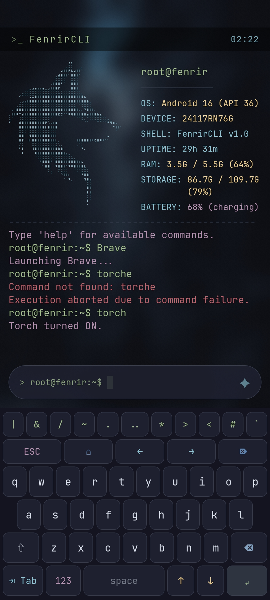

# FenrirCLI

FenrirCLI is a lightweight, high-performance, and feature-rich Command Line Interface (CLI) launcher for Android. Built entirely with **Kotlin** and **Jetpack Compose**, it offers a retro-futuristic hacker-style terminal environment to launch apps, control device hardware, automate flows with macros, and query system stats directly from a console.

<p align="center">
  
</p>

---

## ✨ Features

- ⌨️ **Custom Dedicated Keyboard:** Fully in-app, QWERTY-optimised custom keyboard featuring a top helper row (Esc, Home, arrows, End), layout layer switches, active caps lock/shift indicators, and history up/down arrows.
- 🎨 **Nord Theme Aesthetics:** Visually striking theme based on the popular Nord color palette, complete with smooth animations, custom fonts, customizable block cursor, and modern translucent overlays.
- 🚀 **Fast App Control:** Search, launch, hide, unhide, or inspect app details using command shorthands.
- ⚙️ **Device & Hardware Integration:** Control volume, brightness, flashlight, screen awake states, and dial outgoing phone numbers.
- 🔗 **Aliases & Sequential Chains:** Define custom command macros with `alias name=command` and run multiple commands sequentially using `&&` (e.g., `clear && neofetch`).
- 📊 **Detailed Info Panels:** Custom rich system stats panel and a retro `neofetch` styled Wolf logo banner display hardware configurations, battery status, storage, and uptime.
- 🔍 **Autocompletion & Inline Suggestions:** Real-time command matching and tab suggestions for faster navigation.

---

## 🛠️ Commands Reference

Type `help` in the terminal to view the manual, or `help <command>` for detailed info on a specific command.

| Command | Category | Description | Usage / Example |
| :--- | :--- | :--- | :--- |
| **`help`** | System Info | Show helper manual or command syntax. | `help` or `help volume` |
| **`neofetch`** | System Info | Render terminal logo banner and hardware specs. | `neofetch` |
| **`sysinfo`** | System Info | Show custom panel with detailed device statistics. | `sysinfo` |
| **`version`** | System Info | Show app version, license, and repository link. | `version` |
| **`ls`** | App Control | List all launchable installed applications. | `ls` |
| **`open`** | App Control | Launch a specific app in the foreground. | `open <appname>` |
| **`find`** / **`search`** | App Control | Search for installed applications matching a query. | `find <query>` |
| **`info`** | App Control | Deep-link directly into the app settings details page. | `info <appname>` |
| **`hide`** | App Control | Hide an app from standard directory listings. | `hide <appname>` |
| **`unhide`** | App Control | Restore visibility of an app to listings. | `unhide <appname>` |
| **`uninstall`** | App Control | Request app deletion with y/n confirmation. | `uninstall <appname>` |
| **`alias`** | Scripting | Save a shortcut macro link in local storage. | `alias sys=clear && neofetch` |
| **`unalias`** | Scripting | Delete a shortcut macro key from storage. | `unalias <name>` |
| **`echo`** | Scripting | Echo literal text to the console. | `echo hello world` |
| **`volume`** | Hardware | Set system media/music volume (0-100). | `volume 70` |
| **`bright`** | Hardware | Set screen brightness (0-100) or auto. | `bright 50` or `bright auto` |
| **`torch`** / **`flash`** | Hardware | Toggle the physical LED flashlight. | `torch` |
| **`awake`** | Hardware | Keep screen awake (`lock`/`unlock`/`on`/`off`). | `awake on` |
| **`fontsize`** / **`font`** | Customization | Change console font size (in sp). | `fontsize 14` |
| **`call`** | Communication | Access the dialer to place an outgoing call. | `call 1234567890` |
| **`mute`** | Audio | Force media/music volume to zero (vibrate). | `mute` |
| **`unmute`** | Audio | Restore volume to the last saved level. | `unmute` |
| **`default`** | Navigation | Open Android settings to set default launcher. | `default` |
| **`exit`** | Navigation | Exit to original default system launcher. | `exit` |

---

## 🔨 How to Build & Install

Ensure you have Android SDK, JDK 17, and Gradle installed.

1. **Clone the repository:**
   ```bash
   git clone https://github.com/AllabouchAnas/FenrirCLI.git
   cd FenrirCLI
   ```
2. **Build the Debug APK:**
   ```bash
   ./gradlew assembleDebug
   ```
3. **Install on a connected device:**
   ```bash
   ./gradlew installDebug
   ```

---

## 🤝 Contributing

We welcome contributions from the open-source community! Whether you want to report a bug, suggest features, or submit pull requests to improve the terminal interface or custom keyboard layout, please read our [CONTRIBUTING.md](CONTRIBUTING.md) guide for setup instructions and coding guidelines.

---

## 📄 License

FenrirCLI is open-source software licensed under the **GNU General Public License v3.0 (GPLv3)**. See the [LICENSE](LICENSE) file for the full license text.
